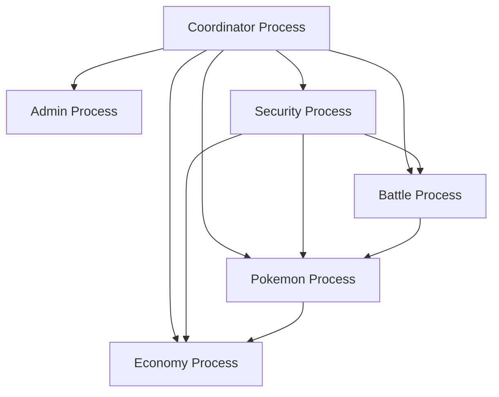

# PokéRogue AO Connect Deployment & Testing Guide

A comprehensive guide to deploying, initializing, and validating the PokéRogue multi-process architecture using `@permaweb/aoconnect`.

## Table of Contents

- [Overview](#overview)
- [Architecture](#architecture)
- [Quick Start](#quick-start)
- [Deployment System](#deployment-system)
- [User Experience Testing](#user-experience-testing)
- [Validation & Monitoring](#validation--monitoring)
- [NPM Commands Reference](#npm-commands-reference)
- [Troubleshooting](#troubleshooting)

## Overview

This guide covers the **Epic 32** multi-process architecture deployment and validation system. It replaces shell-based AOS CLI scripts with programmatic `@permaweb/aoconnect` integration, providing better error handling, logging, and user experience validation.

### Key Features

- ✅ **Programmatic Deployment**: Direct AO Connect API integration
- ✅ **Process Coordination**: Automated inter-process communication setup
- ✅ **User Experience Testing**: Comprehensive game flow validation
- ✅ **Real-time Monitoring**: Health checks and performance tracking
- ✅ **Enterprise Logging**: Structured JSON reports and metrics

## Architecture

### Multi-Process System



### Deployment Flow

1. **Build** → Bundle Lua processes into deployable files
2. **Deploy** → Spawn AO processes using `@permaweb/aoconnect`
3. **Initialize** → Configure processes with setup code
4. **Register** → Establish inter-process communication
5. **Validate** → Test system health and user experience

## Quick Start

### Prerequisites

- Node.js 22+ installed
- `@permaweb/aoconnect` dependency (already in package.json)
- Built process bundles in `build/` directory

### Basic Deployment

```bash
# 1. Build all processes
npm run ao:build

# 2. Deploy with AO Connect
npm run ao:deploy

# 3. Initialize processes
npm run ao:init

# 4. Register and connect processes
npm run ao:register

# 5. Validate system health
npm run ao:validate:game --suite=system-health
```

### Test User Experience

```bash
# Test battle system
npm run ao:simulate:battle

# Test Pokemon management
npm run ao:simulate:pokemon

# Test shop & economy
npm run ao:simulate:shop

# Full system validation
npm run ao:validate:game
```

## Deployment System

### Core Components

#### 1. AO Deployment Library (`scripts/lib/ao-deploy.js`)

```javascript
import { AODeploymentManager } from './lib/ao-deploy.js';

const deployer = new AODeploymentManager({
  verbose: true,
  retryAttempts: 3,
  retryDelay: 5000
});

// Deploy a single process
const result = await deployer.deployProcess('coordinator', {
  bundlePath: 'build/coordinator-process.lua',
  tags: [{ name: 'Process-Role', value: 'coordinator' }]
});
```

**Features:**
- Process spawning with automatic retries
- Chunked code deployment for large bundles
- Health checks and validation
- Rollback capabilities
- Structured logging with timestamps

#### 2. Main Deployment Script (`scripts/ao-deploy.js`)

**Process Deployment Order:**
1. **Coordinator** (process registry, load balancing)
2. **Admin** (user management, system config)
3. **Security** (anti-cheat, validation)
4. **Battle** (combat engine, damage calculation)
5. **Pokemon** (stats, evolution, storage)
6. **Economy** (shop, inventory, trading)

**Example Output:**
```
🎮 PokéRogue AO Process Deployment
=====================================

📋 Deployment Plan:
  1. coordinator (hub)
  2. admin (control)
  3. security (guardian)
  4. battle (processor)
  5. pokemon (data)
  6. economy (service)

🚀 Starting deployment...

✅ coordinator deployed successfully
   Process ID: abc123...
   Duration: 2.3s

✅ admin deployed successfully
   Process ID: def456...
   Duration: 1.8s

📊 Deployment Summary
=====================
Success Rate: 6/6 processes
Total Time: 12s
```

#### 3. Process Initialization (`scripts/ao-init.js`)

Configures each process with:
- **State Management**: Initialize process-specific data structures
- **Message Handlers**: Setup action handlers for process communication
- **Inter-Process Setup**: Configure peer connections and protocols

**Example Coordinator Initialization:**
```lua
-- Initialize Coordinator Process
CoordinatorState = CoordinatorState or {
  processes = {},
  loadBalancer = {
    battlePool = {},
    pokemonPool = {},
    economyPool = {}
  }
}

-- Setup process registry
ProcessRegistry = ProcessRegistry or {}

-- Initialize message handlers
Handlers.add("Register-Process", 
  Handlers.utils.hasMatchingTag("Action", "Register-Process"),
  function(msg)
    local processData = json.decode(msg.Data)
    ProcessRegistry[processData.processType] = processData.processId
    -- ... registration logic
  end
)
```

#### 4. Process Registration (`scripts/ao-register.js`)

Establishes the communication network:

**Communication Matrix:**
- **Coordinator** ↔ All processes (hub pattern)
- **Security** ↔ Battle, Pokemon, Economy (validation)
- **Battle** ↔ Pokemon (stats, status effects)
- **Pokemon** ↔ Economy (trading, items)

**Service Discovery Setup:**
```javascript
const SERVICE_DISCOVERY_CONFIG = {
  protocols: {
    'battle-request': {
      from: ['coordinator'],
      to: ['battle'],
      messageType: 'START_BATTLE',
      validation: ['security']
    },
    'pokemon-query': {
      from: ['battle', 'economy'],
      to: ['pokemon'],
      messageType: 'GET_POKEMON',
      validation: ['security']
    }
    // ... more protocols
  }
}
```

### Deployment Configuration

#### Environment Variables

```bash
# Optional: Custom AO endpoints
export MU_URL="https://mu.ao-testnet.xyz"
export CU_URL="https://cu.ao-testnet.xyz"
export GATEWAY_URL="https://arweave.net"
```

#### Command Line Options

```bash
# Verbose logging
npm run ao:deploy -- --verbose

# Continue on failures
npm run ao:deploy -- --no-fail-fast

# Custom retry settings
npm run ao:deploy -- --retry-attempts=5 --retry-delay=10000
```

## User Experience Testing

### Game Client Library (`scripts/lib/ao-game-client.js`)

High-level interface for simulating player interactions:

```javascript
import { PokéRougeGameClient } from './lib/ao-game-client.js';

// Initialize client
const client = new PokéRougeGameClient({ verbose: true });
await client.initialize('build/ao-registration-results.json');

// Create player
await client.createPlayer({
  name: 'TestPlayer',
  startingPokemon: 'pikachu'
});

// Start battle
const battle = await client.startWildBattle({
  wildPokemon: { species: 'rattata', level: 5 }
});

// Execute battle action
await client.battleAction(battle.battleId, 'attack', {
  moveId: 'thundershock'
});
```

### Battle Flow Simulation

#### Available Scenarios

**Basic Wild Battle:**
```bash
npm run ao:simulate:battle --scenario=basic-wild
```
- Player Pikachu vs Wild Rattata
- Basic attack moves (tackle, thundershock)
- Victory/defeat conditions

**Trainer Battle:**
```bash
npm run ao:simulate:battle --scenario=trainer-battle
```
- Structured trainer encounter
- AI opponent with strategy
- Experience/money rewards

**Gym Battle:**
```bash
npm run ao:simulate:battle --scenario=gym-battle
```
- Type effectiveness testing
- Gym leader AI patterns
- Badge reward system

**Multi-Pokemon Battle:**
```bash
npm run ao:simulate:battle --scenario=multi-pokemon
```
- Party management
- Pokemon switching
- Team strategy validation

**Status Effects:**
```bash
npm run ao:simulate:battle --scenario=status-effects
```
- Sleep, poison, paralysis
- Status condition interactions
- Recovery mechanics

#### Example Battle Output

```
⚔️ PokéRogue Battle Flow Simulation
===================================

🥊 Running: Basic Wild Pokemon Battle
==================================================
🎯 Starting Basic Wild Pokemon Battle...
⚡ Turn 1: attack - tackle
⚡ Turn 2: attack - thundershock
🏁 Battle ended: player wins!

✅ Basic Wild Pokemon Battle completed successfully

📊 Battle Simulation Results
============================
✅ basic-wild
   Duration: 1247ms
   Turns: 2
   Battle ID: abc123-1699123456
```

### Pokemon Management Testing

#### Test Categories

**Stats Calculation:**
```bash
npm run ao:simulate:pokemon --scenario=stats-calculation
```
- IV/EV calculations with different natures
- Level-based stat growth
- Base stat application

**Evolution System:**
```bash
npm run ao:simulate:pokemon --scenario=evolution-system
```
- Level-based evolution (Charmander → Charmeleon)
- Stone-based evolution (Pikachu + Thunder Stone → Raichu)
- Trade evolution (Kadabra → Alakazam)
- Friendship evolution (Eevee → Espeon/Umbreon)

**Move Learning:**
- **Level-up moves**: Natural move progression
- **TM compatibility**: Technical machine validation
- **Egg moves**: Breeding inheritance

**Ability System:**
- Normal abilities assignment
- Hidden ability availability
- Ability interactions

### Shop & Economy Testing

#### Shop Types

**Pokemart:**
```bash
npm run ao:simulate:shop --scenario=basic-shop
```
- Basic items (Pokeballs, Potions)
- Standard pricing
- Inventory management

**Department Store:**
- Premium items (Ultra Balls, Max Potions)
- Bulk purchasing
- Member discounts

**Battle Shop:**
- Battle items (X-Attack, X-Defense)
- Temporary stat boosters
- Tournament supplies

**Berry Shop:**
- Healing berries (Oran, Pecha)
- Status cure berries
- Rare berry varieties

#### Economic Features

**Price Calculations:**
- Base pricing with regional variations
- Bulk purchase discounts
- Member/VIP pricing tiers
- Daily specials and sales

**Trading System:**
- NPC trades with specific requirements
- Player-to-player trading
- Evolution trades (Machoke ↔ Graveler)

**Example Shop Output:**
```
🛒 PokéRogue Shop & Economy Simulation
======================================

💰 Testing: Basic Shop Operations
============================================
🧪 Test 1/4: basic-shop
    Testing shop action: browse...
      Found 12 items in pokemart
  ✅ Test 1 passed

🧪 Test 2/4: basic-shop  
    Testing shop action: purchase...
      Purchase result: pokeball x10
  ✅ Test 2 passed
```

## Validation & Monitoring

### Comprehensive Game Validator

```bash
npm run ao:validate:game
```

#### Validation Suites

**System Health Check:**
- Process availability and response times
- Inter-process communication validation
- Resource usage monitoring

**User Journey Testing:**
- New player onboarding flow
- Advanced gameplay scenarios
- Complete game session simulation

**Data Integrity:**
- Pokemon stats consistency
- Economic data validation
- Battle calculation accuracy

**Performance Testing:**
- Response time benchmarks
- Concurrent user simulation
- Load testing scenarios

**Security Validation:**
- Input sanitization testing
- Anti-cheat system validation
- Rate limiting effectiveness

**Integration Testing:**
- Cross-process workflow validation
- Event propagation testing
- State synchronization checks

#### Example Validation Report

```json
{
  "timestamp": "2024-01-15T10:30:00.000Z",
  "summary": {
    "totalSuites": 6,
    "successful": 6,
    "failed": 0,
    "successRate": "100.0"
  },
  "systemHealth": "HEALTHY",
  "recommendations": [
    {
      "priority": "INFO",
      "category": "system",
      "issue": "All validations passed",
      "suggestion": "System is operating optimally"
    }
  ]
}
```

### Monitoring Dashboard

The validation system provides real-time insights:

**System Metrics:**
- Process health status
- Response time trends
- Error rates and patterns
- Resource utilization

**User Experience Metrics:**
- Battle completion rates
- Shop interaction success
- Pokemon management efficiency
- Overall player journey health

## NPM Commands Reference

### Deployment Commands

```bash
# Core deployment workflow
npm run ao:build              # Build all process bundles
npm run ao:deploy             # Deploy using AO Connect
npm run ao:init               # Initialize process configurations
npm run ao:register           # Register inter-process communication

# Legacy/alternative deployment
npm run ao:deploy:legacy      # Deploy using shell scripts (fallback)
npm run ao:deploy:single      # Deploy single process
npm run ao:deploy:shell       # Original shell-based deployment
```

### Testing & Simulation Commands

```bash
# Battle system testing
npm run ao:simulate:battle                    # All battle scenarios
npm run ao:simulate:battle --scenario=gym-battle --verbose
npm run ao:simulate:battle --list            # List all scenarios

# Pokemon management testing  
npm run ao:simulate:pokemon                   # All Pokemon tests
npm run ao:simulate:pokemon --scenario=evolution-system
npm run ao:simulate:pokemon --save=results.json

# Shop & economy testing
npm run ao:simulate:shop                      # All economy tests
npm run ao:simulate:shop --scenario=specialized-shops
npm run ao:simulate:shop --fail-fast

# Comprehensive validation
npm run ao:validate:game                      # Full validation suite
npm run ao:validate:game --suite=system-health
npm run ao:validate:game --report=validation.json
```

### Utility Commands

```bash
# Build and validation
npm run ao:build:dev          # Development build with debugging
npm run ao:validate:build     # Validate build artifacts
npm run ao:clean             # Clean build directory

# System management
npm run ao:test              # Run AO process tests
npm run ao:validate          # Validate deployment
npm run ao:rollback          # Rollback failed deployment
npm run ao:guide             # Show deployment guide
```

### Command Options

Most commands support common options:

```bash
--verbose, -v                # Enable detailed logging
--fail-fast                  # Stop on first failure  
--help, -h                   # Show command help
--list                       # List available scenarios/suites
--scenario=<name>            # Run specific scenario
--suite=<name>               # Run specific test suite
--save=<filename>            # Save detailed results
--report=<filename>          # Custom report filename
--registration=<path>        # Custom registration file
```

## Troubleshooting

### Common Issues

#### Deployment Failures

**Issue: Process spawn timeout**
```bash
Error: Failed to spawn coordinator after 3 attempts: Timeout
```

**Solution:**
```bash
# Increase timeout and retry attempts
npm run ao:deploy -- --retry-attempts=5 --retry-delay=10000
```

**Issue: Bundle file not found**
```bash
Error: Bundle file not found: build/coordinator-process.lua
```

**Solution:**
```bash
# Rebuild processes first
npm run ao:build
npm run ao:deploy
```

#### Communication Issues

**Issue: Process registration failed**
```bash
Error: Failed to register pokemon with coordinator
```

**Solution:**
```bash
# Check process health
npm run ao:validate:game --suite=system-health

# Re-register if needed
npm run ao:register
```

#### Testing Failures

**Issue: Battle simulation timeout**
```bash
Error: Battle action failed: Timeout waiting for response
```

**Solutions:**
1. Check process health: `npm run ao:validate:game --suite=system-health`
2. Restart processes: Redeploy the system
3. Check network connectivity to AO nodes

### Debug Mode

Enable verbose logging for all commands:

```bash
export DEBUG=true
npm run ao:deploy --verbose
npm run ao:validate:game --verbose
```

### Log Files

Key log locations:
- `build/deployment.log` - Deployment process logs
- `build/ao-deployment-results.json` - Deployment results
- `build/ao-registration-results.json` - Registration results  
- `build/validation-report.json` - Validation reports

### Health Checks

Quick system health validation:

```bash
# Check all processes
npm run ao:validate:game --suite=system-health

# Check specific process communication
npm run ao:validate:game --suite=integration

# Performance check
npm run ao:validate:game --suite=performance
```

### Recovery Procedures

**Complete system restart:**
```bash
npm run ao:clean
npm run ao:build
npm run ao:deploy
npm run ao:init
npm run ao:register
npm run ao:validate:game
```

**Partial process restart:**
```bash
# Redeploy specific processes if needed
npm run ao:rollback
npm run ao:deploy
```

### Getting Help

```bash
# Command-specific help
npm run ao:deploy --help
npm run ao:simulate:battle --help
npm run ao:validate:game --help

# List available options
npm run ao:simulate:battle --list
npm run ao:simulate:pokemon --list
npm run ao:validate:game --list
```

---

## Summary

This deployment and testing system provides:

✅ **Production-Ready Deployment**: Reliable, programmatic process deployment
✅ **User Experience Validation**: Comprehensive game flow testing
✅ **System Health Monitoring**: Real-time process and performance monitoring
✅ **Developer Experience**: Clear commands, detailed logging, and error handling
✅ **CI/CD Integration**: JSON reports and exit codes for automation

The system ensures your Epic 32 multi-process architecture delivers a smooth, validated user experience while providing the tools needed for ongoing maintenance and development.