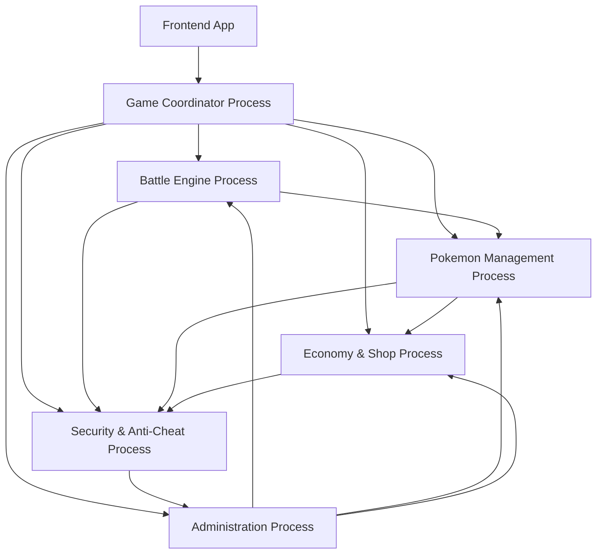

# PokéRogue Multi-Process Architecture Enhancement

## Introduction

This document outlines the architectural approach for enhancing PokéRogue with a multi-process architecture to address the critical bundle size issue (current single process: 2.1MB). Its primary goal is to serve as the guiding architectural blueprint for AI-driven development while ensuring seamless integration with the existing AO process system.

**Relationship to Existing Architecture:**
This document supplements the existing PokéRogue AO Process Architecture by defining how new components will integrate with current systems. The enhancement splits the monolithic process into focused, lightweight processes while maintaining all existing functionality and API compatibility.

## Existing Project Analysis

### Current Project State
- **Primary Purpose:** PokéRogue is a Phaser-based Pokémon battle game with AO (Autonomous Objects) processes handling game logic validation, anti-cheating, and secure state management
- **Current Tech Stack:** TypeScript + Vite + Phaser 3.90.0 (frontend), Lua-based AO processes on Arweave (backend), Vitest + Aolite testing
- **Architecture Style:** Monolithic AO process with modular handler system
- **Deployment Method:** Single bundled Lua process (main.bundled.lua - 2.1MB) deployed to Arweave AO

### Available Documentation
- Main architecture.md with AO process design
- Comprehensive testing framework using aolite
- Handler-based modular design already in place
- Parity testing between TypeScript and Lua implementations

### Identified Constraints
- **AO Process Size Limits:** Large processes impact deployment cost and execution efficiency
- **Handler Interdependencies:** Current handlers share state and may have complex interactions
- **Testing Complexity:** Parity testing between TS/Lua across multiple processes
- **State Management:** Current monolithic state needs distribution strategy
- **Message Routing:** Inter-process communication patterns needed

### Change Log
| Change | Date | Version | Description | Author |
|--------|------|---------|-------------|--------|
| Initial Multi-Process Architecture | 2025-01-25 | v1.0 | Created multi-process architecture to address 2.1MB bundle size issue | Winston (Architect) |

## Enhancement Scope and Integration Strategy

### Enhancement Overview
**Enhancement Type:** Architectural Decomposition  
**Scope:** Split monolithic AO process into 4-6 specialized processes  
**Integration Impact:** Medium - requires new inter-process messaging but leverages existing handler structure

### Integration Approach
**Code Integration Strategy:** Preserve existing handler logic, extract into dedicated processes  
**Database Integration:** Distributed state management with process-specific schemas  
**API Integration:** New inter-process messaging layer with existing external API patterns  
**UI Integration:** Minimal impact - frontend still communicates with primary coordinator process

### Compatibility Requirements
- **Existing API Compatibility:** 100% - frontend API remains unchanged
- **Database Schema Compatibility:** Enhanced - each process manages domain-specific state
- **UI/UX Consistency:** No impact - transparent to users
- **Performance Impact:** Improved - smaller processes = faster execution, parallel processing

## Tech Stack Alignment

### Existing Technology Stack
| Category | Current Technology | Version | Usage in Enhancement | Notes |
|----------|-------------------|---------|---------------------|-------|
| **AO Runtime** | Lua | 5.3 | Core process logic | Maintained across all processes |
| **Build System** | Harlequin bundler | Latest | Process bundling | Enhanced for multi-process builds |
| **Testing Framework** | Aolite | Latest | Local AO emulation | Extended for multi-process testing |
| **Frontend** | TypeScript + Vite | 5.8.3 / 7.0.6 | Unchanged | No frontend changes required |
| **Game Engine** | Phaser | 3.90.0 | Unchanged | Process architecture transparent to client |
| **Message Format** | AO Message Protocol | Current | Enhanced | Extended for inter-process communication |

### New Technology Additions
| Technology | Version | Purpose | Rationale | Integration Method |
|------------|---------|---------|-----------|-------------------|
| **Process Orchestration Scripts** | Custom | Multi-process deployment | Need coordinated process deployment | New deployment scripts |
| **Message Correlation System** | Custom | Inter-process tracing | Track requests across process boundaries | Built into coordinator process |
| **Distributed State Sync** | Custom | Process state consistency | Ensure data consistency across processes | Event-driven state updates |

## Data Models and Schema Changes

### New Data Models

#### Process Registry
**Purpose:** Track active processes and their capabilities  
**Integration:** Central registry in coordinator process

**Key Attributes:**
- process_id: string - Unique AO process identifier
- process_type: string - Domain type (battle, pokemon, economy, etc.)
- capabilities: table - List of supported operations
- health_status: string - Current process health state
- last_heartbeat: number - Last health check timestamp

**Relationships:**
- **With Existing:** Extends current process metadata
- **With New:** Referenced by all inter-process messages

#### Message Correlation
**Purpose:** Track multi-process operations and maintain request context  
**Integration:** Correlation tracking across all processes

**Key Attributes:**
- correlation_id: string - Unique operation identifier
- origin_process: string - Initiating process ID
- target_processes: table - List of involved processes
- operation_type: string - Type of multi-process operation
- status: string - Current operation status
- created_at: number - Operation start time
- completed_at: number - Operation completion time

**Relationships:**
- **With Existing:** Enhances current correlation ID system
- **With New:** Links all inter-process communications

### Schema Integration Strategy
**Database Changes Required:**
- **New Tables:** Process registry, message correlation, distributed locks
- **Modified Tables:** Enhanced existing state tables with process ownership
- **New Indexes:** Process lookup indexes, correlation tracking indexes
- **Migration Strategy:** Gradual migration with backward compatibility

**Backward Compatibility:**
- Maintain existing single-process message formats during transition
- Preserve existing state schema with process-specific extensions
- Support hybrid deployment (some processes split, others monolithic)

## Component Architecture

### New Components

#### Game Coordinator Process (~200KB)
**Responsibility:** Primary interface, message routing, and session management  
**Integration Points:** All other processes, frontend API

**Key Interfaces:**
- External API gateway (maintains existing frontend compatibility)
- Inter-process message routing and correlation
- Session state coordination

**Dependencies:**
- **Existing Components:** Frontend applications, external APIs
- **New Components:** All domain processes (2-6)

**Technology Stack:** Lua AO process with message routing handlers

#### Battle Engine Process (~800KB)
**Responsibility:** Battle calculations, damage computation, type effectiveness  
**Integration Points:** Pokemon data process, RNG process

**Key Interfaces:**
- Battle resolution API
- Damage calculation engine
- Move effect processing

**Dependencies:**
- **Existing Components:** BattleHandler logic, ValidationHandler for battle rules
- **New Components:** Pokemon Process (for stats), RNG Process (for calculations)

**Technology Stack:** Lua AO process with computational handlers

#### Pokemon Management Process (~400KB)
**Responsibility:** Pokemon data, stats, evolution, and party management  
**Integration Points:** Battle engine, shop system

**Key Interfaces:**
- Pokemon CRUD operations
- Stats calculation and validation
- Evolution and level progression

**Dependencies:**
- **Existing Components:** StateHandler pokemon logic, QueryHandler pokemon queries
- **New Components:** Shop Process (for items), Battle Process (for battle stats)

**Technology Stack:** Lua AO process with data management handlers

#### Economy & Shop Process (~300KB)
**Responsibility:** Berry system, shop operations, item management  
**Integration Points:** Pokemon process, anti-cheat process

**Key Interfaces:**
- Shop transaction processing
- Berry system mechanics
- Item effect validation

**Dependencies:**
- **Existing Components:** BerryHandler, ShopHandler logic
- **New Components:** Pokemon Process (for item applications), Anti-cheat Process

**Technology Stack:** Lua AO process with transaction handlers

#### Security & Anti-Cheat Process (~200KB)
**Responsibility:** Validation, anti-cheat detection, audit logging  
**Integration Points:** All processes for validation

**Key Interfaces:**
- Real-time validation engine
- Cheat detection algorithms
- Audit trail management

**Dependencies:**
- **Existing Components:** AntiCheatHandler, ValidationHandler logic
- **New Components:** All other processes (for validation)

**Technology Stack:** Lua AO process with security handlers

#### Administration Process (~100KB)
**Responsibility:** Process health, admin operations, monitoring  
**Integration Points:** All processes for health checks

**Key Interfaces:**
- Health monitoring dashboard
- Admin command processing
- Process lifecycle management

**Dependencies:**
- **Existing Components:** AdminHandler, ErrorHandler logic
- **New Components:** All processes (for administration)

**Technology Stack:** Lua AO process with admin handlers

### Component Interaction Diagram



## Source Tree Integration

### Existing Project Structure
```
ao-processes/
├── game-logic/           # Core game mechanic processes
│   ├── pokemon/         # Pokemon-related validation
│   └── rng/            # Random number generation
├── handlers/           # AO message handlers
├── tests/             # Test suites (uses aolite)
└── main.lua          # Main process entry point (2.1MB bundled)
```

### New File Organization
```
ao-processes/
├── processes/                    # Multi-process implementations
│   ├── coordinator/             # Game Coordinator Process
│   │   ├── main.lua
│   │   ├── routing-handler.lua
│   │   └── session-handler.lua
│   ├── battle-engine/          # Battle Engine Process  
│   │   ├── main.lua
│   │   ├── battle-handler.lua
│   │   └── damage-calculator.lua
│   ├── pokemon-management/      # Pokemon Management Process
│   │   ├── main.lua
│   │   ├── pokemon-handler.lua
│   │   └── stats-calculator.lua
│   ├── economy-shop/           # Economy & Shop Process
│   │   ├── main.lua
│   │   ├── shop-handler.lua
│   │   └── berry-handler.lua
│   ├── security-anticheat/     # Security & Anti-Cheat Process
│   │   ├── main.lua
│   │   ├── validation-handler.lua
│   │   └── anticheat-handler.lua
│   └── administration/         # Administration Process
│       ├── main.lua
│       ├── admin-handler.lua
│       └── health-monitor.lua
├── shared/                     # Shared libraries across processes
│   ├── message-protocol.lua
│   ├── correlation-manager.lua
│   └── state-validator.lua
├── legacy/                     # Existing monolithic process
│   └── main.lua               # Original 2.1MB process (for fallback)
├── tests/                     # Enhanced multi-process testing
│   ├── integration/           # Cross-process integration tests
│   ├── process-specific/      # Individual process tests
│   └── parity/               # TS/Lua parity tests
└── deployment/               # Multi-process deployment scripts
    ├── orchestrator.lua
    ├── health-check.lua
    └── rollback.lua
```

### Integration Guidelines
- **File Naming:** Consistent kebab-case for process directories, snake_case for Lua files
- **Folder Organization:** Process-based organization with shared utilities
- **Import/Export Patterns:** Require-based imports with shared library consistency

## Infrastructure and Deployment Integration

### Existing Infrastructure
**Current Deployment:** Single bundled Lua process deployed to AO network  
**Infrastructure Tools:** Harlequin bundler, custom deployment scripts  
**Environments:** Local (aolite), AO testnet, AO mainnet

### Enhancement Deployment Strategy
**Deployment Approach:** Coordinated multi-process deployment with health validation  
**Infrastructure Changes:** Process orchestration layer, health monitoring, inter-process discovery  
**Pipeline Integration:** Enhanced build system for multiple process bundles

### Rollback Strategy
**Rollback Method:** Fallback to monolithic process deployment  
**Risk Mitigation:** Blue-green deployment with process health checks  
**Monitoring:** Process health dashboard, inter-process communication metrics

## Coding Standards and Conventions

### Existing Standards Compliance
**Code Style:** Lua with consistent indentation, snake_case for variables, PascalCase for modules  
**Linting Rules:** No formal linter detected - opportunity for improvement  
**Testing Patterns:** Aolite-based testing with handler-specific test suites  
**Documentation Style:** Inline comments with module headers, function documentation

### Enhancement-Specific Standards
- **Inter-Process Message Format:** Standardized JSON schema with correlation IDs and timestamps
- **Process Naming Convention:** Domain-based naming (battle-process, pokemon-process, etc.)
- **Handler Registration Pattern:** Consistent handler naming across all processes
- **Error Propagation Standard:** Standardized error codes that work across process boundaries

### Critical Integration Rules
- **Existing API Compatibility:** All inter-process changes must be transparent to frontend
- **Database Integration:** Each process owns its domain data, with clear boundaries
- **Error Handling:** Distributed error handling with correlation tracking across processes
- **Logging Consistency:** Unified logging format with process identification and correlation IDs

## Testing Strategy

### Integration with Existing Tests
**Existing Test Framework:** Vitest (frontend) + Aolite (AO processes)  
**Test Organization:** Handler-specific test suites in `/tests` directory  
**Coverage Requirements:** Maintain existing test coverage while adding multi-process scenarios

### New Testing Requirements

#### Unit Tests for New Components
- **Framework:** Aolite (existing)
- **Location:** `tests/multi-process/` directory
- **Coverage Target:** 90% for new inter-process communication logic
- **Integration with Existing:** Extend existing handler tests to work in isolated process context

#### Integration Tests
- **Scope:** End-to-end workflows spanning multiple processes
- **Existing System Verification:** Ensure single-process fallback mode still works
- **New Feature Testing:** Multi-process message flows, process coordination, fault tolerance

#### Regression Testing
- **Existing Feature Verification:** All current game mechanics must work identically
- **Automated Regression Suite:** Extended parity testing between monolithic and multi-process modes
- **Manual Testing Requirements:** Performance testing under various load conditions

## Security Integration

### Existing Security Measures
**Authentication:** Process-level authentication with AO message signing  
**Authorization:** Handler-level authorization with role-based access  
**Data Protection:** State validation and anti-cheat mechanisms  
**Security Tools:** AntiCheatHandler, ValidationHandler

### Enhancement Security Requirements
**New Security Measures:** Inter-process message authentication, process identity validation  
**Integration Points:** Each process must validate messages from other processes  
**Compliance Requirements:** Maintain existing anti-cheat effectiveness across distributed architecture

### Security Testing
**Existing Security Tests:** Handler-level validation tests  
**New Security Test Requirements:** Inter-process security validation, message tampering resistance  
**Penetration Testing:** Multi-process attack surface analysis

## Next Steps

### Story Manager Handoff
Create epic for multi-process architecture implementation with the following scope:
- Reference this architecture document for all implementation decisions
- Key integration requirements: maintain 100% API compatibility with existing frontend
- Existing system constraints: leverage current handler structure, preserve all game mechanics
- First story: Implement Game Coordinator Process with message routing to existing monolithic process (hybrid mode)
- Integration checkpoints: validate each process split maintains parity with original system
- Emphasis: maintain existing system integrity throughout implementation with comprehensive regression testing

### Developer Handoff
Begin implementation with the following guidance:
- Reference this architecture and existing coding standards analyzed from actual project structure
- Integration requirements: each new process must be tested in isolation and as part of the distributed system
- Key technical decisions: use existing handler patterns, maintain current message protocols, extend correlation system
- System compatibility: implement gradual migration strategy allowing rollback to monolithic process
- Implementation sequencing: start with coordinator process, then split handlers one domain at a time to minimize risk

## Benefits Summary

### Bundle Size Reduction
- **Before:** Single 2.1MB bundled process
- **After:** 6 lightweight processes (200KB-800KB each)
- **Total Size:** ~2.0MB distributed across multiple efficient processes
- **Deployment Impact:** Faster individual process updates, reduced AO gas costs

### Performance Improvements
- **Parallel Processing:** Multiple processes can execute concurrently
- **Resource Efficiency:** Each process loads only necessary code and data
- **Scaling:** Individual processes can be scaled based on demand
- **Fault Isolation:** Process failures don't bring down entire system

### Development Benefits
- **Modular Development:** Teams can work on processes independently
- **Testing Isolation:** Each process can be tested in isolation
- **Deployment Flexibility:** Individual processes can be updated without system-wide deployment
- **Maintainability:** Clear separation of concerns across business domains