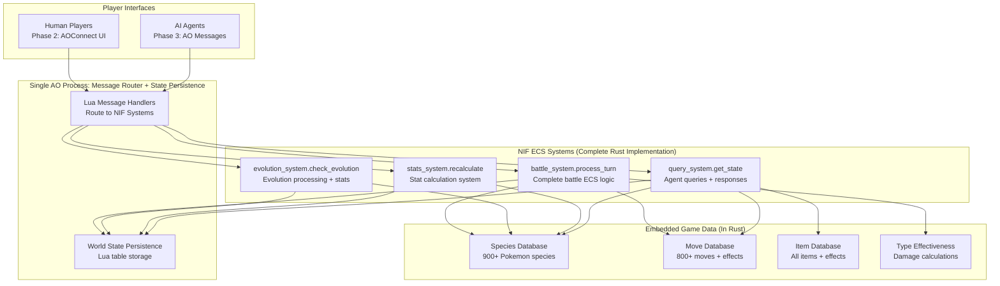

# PokéRogue ECS HyperBeam Architecture

## Overview

PokéRogue implements a greenfield Entity-Component-System (ECS) architecture on the Arweave AO platform. The system leverages Native Implemented Functions (NIFs) as global Lua modules for high-performance game calculations while maintaining a pure Lua ECS for game state management.

### Change Log

| Date | Version | Description | Author |
|------|---------|-------------|---------|
| 2025-01-26 | 1.0.0 | Initial architecture document | Architect Agent |
| 2025-01-26 | 2.0.0 | **MAJOR ARCHITECTURE REVISION**: HyperBEAM + Rust NIF Devices | Architect Agent |
| 2025-09-08 | 3.0.0 | **GREENFIELD ECS HYPERBEAM ARCHITECTURE**: Complete project reset | Product Owner |

## High Level Architecture

### Technical Summary

The PokéRogue AO migration employs an **ECS architecture with NIF-powered systems**, transforming the existing object-oriented TypeScript codebase into an Entity-Component-System running on a single AO process. The architecture prioritizes **100% behavioral parity** with the current implementation while leveraging Native Implemented Functions (NIFs) as complete ECS systems implemented in Rust. Core architectural patterns include Lua message routing, NIF systems for all game logic, deterministic world state management, and efficient component-based data organization, directly supporting the PRD's goal of creating the world's first fully UI-agnostic roguelike where AI agents battle as first-class citizens.

### High Level Overview

**Architectural Style:** **Single-Process ECS with NIF Systems**
- Single AO process managing ECS world state and message routing
- Native Implemented Functions (NIFs) implementing complete ECS systems in Rust
- Lua handlers route messages to appropriate NIF systems
- Embedded game data within process bundle for self-contained operation

**Repository Structure:** **Monorepo** (from PRD Technical Assumptions)
- `/nifs/` - Rust NIF systems (battle_system, evolution_system, stats_system)
- `/shared/` - Shared Rust ECS types (WorldState, components, entities)
- `/ao-process/` - AO process with Lua message handlers and world state persistence
- `/game-data/` - Pokemon species, moves, and items data embedded in Rust
- `/typescript-reference/` - Current implementation for parity testing

**Service Architecture:** **Single AO Process + NIF Systems + HyperBeam Pathing**
- AO process handles message routing and world state persistence
- NIF systems implement complete ECS logic (entities, components, systems) in Rust
- HyperBeam pathing exposes state via HTTP GET requests for read-only access
- World state passed between NIF systems for processing
- Lua handlers orchestrate system execution and state management

**Primary Data Flow:** **Player → AO Message/HyperBeam Path → Lua Router → NIF System → GameState Update → Response**
1. Players/agents send AO messages (writes) OR HyperBeam HTTP paths (reads) to the process
2. Lua message handlers route to appropriate NIF systems for processing
3. HyperBeam paths provide direct access to GameState fields for read operations
4. NIF system converts GameState to internal Bevy World, processes game logic, and returns updated GameState
5. Process persists GameState and sends response via AO message or HTTP path response

**Key Architectural Decisions:**
- **ECS in Rust:** Complete Entity-Component-System implementation in NIF systems
- **NIF Systems:** Each game system (battle, evolution, stats) as dedicated NIF function
- **Lua Orchestration:** Lightweight message routing and world state persistence in Lua
- **Single Process:** Unified world state passed between NIF systems
- **Agent-First:** Rich query interfaces designed for autonomous agent participation
- **HyperBeam Pathing:** HTTP GET access to process state via URL path navigation

### High Level Project Diagram



### Architectural and Design Patterns

- **Bevy ECS Pattern:** Complete ECS implementation using Bevy's battle-tested architecture - _Rationale:_ Production-ready ECS with built-in serialization, change detection, and resource management

- **NIF System Pattern:** Each game system (battle, evolution, stats) implemented as dedicated NIF function operating on Bevy World - _Rationale:_ Complete system logic runs at native speed with rich ECS features

- **Custom GameState Serialization:** Custom GameState struct serialized across NIF boundaries, converted to Bevy World internally - _Rationale:_ Efficient serialization with full Bevy ECS benefits inside NIFs

- **Lua Message Orchestration:** Lightweight Lua handlers route messages to appropriate NIF systems - _Rationale:_ Simple message routing with minimal overhead, leveraging AO's native Lua environment

- **ECS Resources for Game Data:** Pokemon species, moves, and items stored as Bevy Resources - _Rationale:_ Type-safe global data access within ECS systems, compile-time optimization

- **Component-Based Pokemon:** Pokemon represented as entities with modular components (Stats, Status, Moves) - _Rationale:_ Flexible composition enables easy extension and efficient queries

- **Bevy Change Detection:** Track component modifications between NIF calls - _Rationale:_ Enables efficient delta updates and optimized processing

- **Query-Based Agent Interface:** Bevy's rich query system enables complex agent state access - _Rationale:_ Powerful filtering and iteration capabilities for AI decision-making

- **HyperBeam State Pathing:** Direct HTTP GET access to process state fields via URL navigation - _Rationale:_ Enables read-only state access without message overhead, perfect for agent polling and UI updates

## Tech Stack

### Cloud Infrastructure
- **Provider:** Arweave Network (AO Protocol)
- **Key Services:** AO process hosting, embedded data storage, AOConnect for Phase 2 integration  
- **Deployment Regions:** Global (decentralized AO network)

### Technology Stack Table

| Category | Technology | Version | Purpose | Rationale |
|----------|------------|---------|---------|-----------|
| **Process Runtime** | AO (ArOS) | Latest | Lua execution environment | Standard AO runtime with NIF support |
| **NIF Language** | Rust | 1.70+ | Complete ECS systems implementation | Type safety, performance, rich ecosystem |
| **NIF Compilation** | Native Shared Library | Latest | ECS systems as Lua-callable functions | Maximum performance for complete game logic |
| **ECS Implementation** | Bevy ECS | 0.12+ | Entity-Component-System with built-in serialization | Production-ready ECS with serde support for NIF boundaries |
| **Game Data Storage** | Bevy Resources | - | Pokemon/move/item databases as ECS resources | Zero-latency access, type-safe global state |
| **State Management** | Custom GameState | - | Serializable game state converted to Bevy World in NIFs | Efficient Lua-Rust serialization with internal ECS benefits |
| **Message Protocol** | AO Messages (JSON) | - | Player/agent communication | Native AO protocol, AOConnect compatible |
| **RNG System** | NIF + Battle Seeds | - | Deterministic randomness | Native performance with cross-call consistency |
| **Development Tools** | Cargo + Rustler | Latest | Rust NIF toolchain | Industry standard Rust-Lua integration |
| **Testing Framework** | Lua + NIF testing | Latest | ECS + NIF integration tests | Lightweight testing with TypeScript parity validation |
| **Process Discovery** | AO Info Protocol | Latest | Standard process discovery | Native AO documentation compliance |
| **HTTP State Access** | HyperBeam Pathing | Latest | GET request state reading | Direct URL-based access to process state fields |

## Data Models

### Pokemon Model

**Purpose:** Represents individual Pokemon with complete battle stats, progression, and state information

**Key Attributes:**
- `id`: number - Unique Pokemon instance identifier
- `speciesId`: string - Species identifier from SpeciesId enum
- `level`: number - Current Pokemon level (1-100)
- `exp`: number - Total experience points
- `hp`: number - Current hit points
- `maxHp`: number - Maximum hit points at current level
- `stats`: table - Current battle stats [HP, ATK, DEF, SPATK, SPDEF, SPEED]
- `ivs`: table - Individual values for stat calculation
- `nature`: string - Nature affecting stat growth
- `moveset`: table - Array of PokemonMove objects
- `statusEffect`: string|nil - Current status condition
- `abilities`: table - Available abilities and current selection
- `heldItem`: string|nil - Currently held item identifier
- `battleData`: table - Temporary battle-specific data

**Relationships:**
- Belongs to Player (via party roster)
- References Species data (via speciesId)
- Contains Move data (via moveset array)
- Links to Battle data (when actively battling)

### Battle Model

**Purpose:** Manages active battle state including turn order, commands, and battle-specific conditions

**Key Attributes:**
- `battleId`: string - Unique battle session identifier
- `playerId`: string - Player wallet address
- `battleType`: string - Type of battle (WILD, TRAINER, GYM, etc.)
- `turn`: number - Current battle turn
- `battleSeed`: string - Deterministic RNG seed
- `playerParty`: table - Player's active Pokemon
- `enemyParty`: table - Enemy Pokemon data
- `turnCommands`: table - Queued player commands
- `battleState`: string - Current battle phase
- `conditions`: table - Active field conditions and effects

**Relationships:**
- Contains Pokemon instances (player and enemy parties)
- References Player progression data
- Links to Move usage history
- Connects to Item usage tracking

### Player Model

**Purpose:** Stores comprehensive player progression, save data, and game state across sessions

**Key Attributes:**
- `playerId`: string - Player wallet address (AO identity)
- `gameVersion`: string - Save data version for migration compatibility
- `progression`: table - Game progression state
- `party`: table - Current Pokemon party (up to 6)
- `pcStorage`: table - PC Pokemon storage system
- `inventory`: table - Items, money, and resources
- `pokedex`: table - Species seen/caught tracking
- `gameStats`: table - Battle wins, losses, playtime
- `settings`: table - Game preferences and options

**Relationships:**
- Owns Pokemon collection (party + PC)
- Tracks Battle participation history
- Maintains Item inventory
- Records Species discovery progress

## Components

### Battle Resolution Handler

**Responsibility:** Complete battle turn processing including damage calculation, status effects, stat modifications, and deterministic outcome resolution

**Key Interfaces:**
- `processBattleTurn(battleCommand)` - Main battle logic entry point
- `calculateDamage(attacker, defender, move)` - Damage calculation with type effectiveness
- `applyStatusEffects(pokemon, effects)` - Status condition application and resolution
- `validateBattleState(battleId, expectedHash)` - Battle state consistency verification

**Dependencies:** 
- Pokemon stat calculation system (from enhanced data models)
- Move database for power, accuracy, and effect definitions
- Type effectiveness matrix for damage multipliers
- RNG system using AO crypto module for deterministic randomness

**Technology Stack:** Lua handlers with JSON message processing, AO crypto RNG for battle seeds

### Pokemon State Manager

**Responsibility:** Pokemon creation, stat calculation, evolution, and state persistence with mathematical precision matching TypeScript implementation

**Key Interfaces:**
- `createPokemon(speciesId, level, ivs, nature)` - Pokemon instantiation with stat calculation
- `recalculateStats(pokemonId)` - Stat recalculation with modifier application
- `applyStatModifiers(pokemon, modifiers)` - Precise modifier application in correct order
- `evolvePokemon(pokemonId, evolutionId)` - Evolution processing with stat recalculation

**Dependencies:**
- Species database for base stats and evolution trees
- Nature system for stat multipliers (exact 0.9/1.1 values)
- Modifier system for vitamins, items, and ability effects
- Experience calculation for level progression

**Technology Stack:** In-process Lua tables with embedded species data, custom stat calculation matching TypeScript formulas

### Game State Coordinator

**Responsibility:** Player progression, save/load operations, cross-session state consistency, and game flow management

**Key Interfaces:**
- `saveGameState(playerId, gameData)` - Complete game state serialization
- `loadGameState(playerId)` - Game state restoration with validation
- `updateProgression(playerId, progressData)` - Wave advancement and unlock tracking  
- `validateStateIntegrity(playerId)` - Save data corruption prevention

**Dependencies:**
- Player data models for progression tracking
- Pokemon state for party and PC management
- Item inventory for resource tracking
- Battle history for statistics

**Technology Stack:** AO process memory with JSON serialization, state validation checksums

### Query Response Handler

**Responsibility:** State queries for agents and UI systems, battle information retrieval, and process discovery for autonomous agents

**Key Interfaces:**
- `queryBattleState(battleId, queryType)` - Current battle information for decision making
- `queryPlayerState(playerId, stateType)` - Player progression and Pokemon data
- `queryProcessInfo()` - AO documentation protocol compliance for agent discovery
- `queryAvailableActions(battleId, playerId)` - Valid command options for current battle state

**Dependencies:**
- Battle state data for current turn information
- Player state for party and progression queries
- Move database for available action validation
- Process metadata for agent discovery

**Technology Stack:** Native AO handlers with JSON responses, AO documentation protocol compliance

### Process Administration Handler

**Responsibility:** AO documentation protocol compliance, process information, handler discovery, and agent integration support

**Key Interfaces:**
- `getProcessInfo()` - Process metadata and capabilities
- `discoverHandlers()` - Available message handlers for agents
- `getMessageSchemas()` - JSON schemas for agent development
- `validateMessageFormat(messageType, data)` - Input validation for all handlers

**Dependencies:**
- Process configuration and version information
- Handler registry for discovery
- Message schema definitions
- Validation logic for all message types

**Technology Stack:** AO Info handler compliance, JSON schema validation, process documentation

## Core Workflows

### Workflow 1: Battle Turn Resolution


### Workflow 2: Agent Battle Decision Process (Phase 3)


## HyperBeam HTTP GET State Access

### URL Path Pattern

HyperBeam enables direct HTTP GET access to process state via URL path navigation:

```
GET https://[hyperbeam-node]/[process-id]~process@1.0/[state-path]
```

### Pokemon Game State Paths

#### Player Data Access
```bash
# Get full player state
GET /pokemon-game~process@1.0/players/alice123

# Get player's Pokemon party
GET /pokemon-game~process@1.0/players/alice123/party

# Get specific Pokemon stats
GET /pokemon-game~process@1.0/players/alice123/party/0/stats

# Get player progression
GET /pokemon-game~process@1.0/players/alice123/progression
```

#### Battle State Access
```bash
# Get current battle state
GET /pokemon-game~process@1.0/battles/battle_456

# Get battle participants
GET /pokemon-game~process@1.0/battles/battle_456/participants

# Get available actions for agent decision-making
GET /pokemon-game~process@1.0/battles/battle_456/available-actions

# Get battle turn history
GET /pokemon-game~process@1.0/battles/battle_456/history
```

#### Game Data Access
```bash
# Get Pokemon species data
GET /pokemon-game~process@1.0/data/species/charizard

# Get move information
GET /pokemon-game~process@1.0/data/moves/flamethrower

# Get type effectiveness chart
GET /pokemon-game~process@1.0/data/type-effectiveness
```

### Implementation Pattern

The AO process exposes GameState fields that HyperBeam can navigate via paths:

```lua
-- GameState organized for path navigation
GameState = {
    entities = {
        ["pokemon_123"] = { entity_type = "pokemon", components = {...} },
        ["player_alice"] = { entity_type = "player", components = {...} }
    },
    pokemon_stats = {
        ["pokemon_123"] = { hp = 100, attack = 80, defense = 75, ... }
    },
    battle_states = {
        ["battle_456"] = {
            battle_id = "battle_456",
            participants = {...},
            ["available-actions"] = {...},
            turn = 3,
            status = "active"
        }
    },
    player_sessions = {
        ["alice123"] = {
            player_id = "alice123",
            progression = { wave = 15, biome = "forest" },
            party = { "pokemon_123", "pokemon_124" }
        }
    },
    -- Global game data embedded in GameState
    species_database = { charizard = {...} },
    moves_database = { flamethrower = {...} }
}
```

### Agent Integration Example

```javascript
// Agent reads battle state via HTTP GET
const battleState = await fetch(
    'https://forward.computer/pokemon-game~process@1.0/battle_states/battle_456'
).then(r => r.json());

// Agent reads available actions  
const availableActions = await fetch(
    'https://forward.computer/pokemon-game~process@1.0/battle_states/battle_456/available-actions'
).then(r => r.json());

// Agent reads Pokemon stats for decision-making
const pokemonStats = await fetch(
    'https://forward.computer/pokemon-game~process@1.0/pokemon_stats/pokemon_123'
).then(r => r.json());

// Agent makes decision and sends AO message for action
await ao.message({
    Target: "pokemon-game-process-id",
    Action: "battle-turn", 
    Data: { battleId: "battle_456", command: "FIGHT", move: "flamethrower" }
});
```

This pattern enables **read-only access** via HTTP GET for state polling while **writes** still go through AO messages for proper consensus and state management.

## Database Schema (Embedded Lua Data Structures)

### Species Database Schema

```lua
-- Species Database Structure
local SpeciesDatabase = {
  [SPECIES.CHARIZARD] = {
    speciesId = SPECIES.CHARIZARD,
    name = "Charizard",
    baseStats = {78, 84, 78, 109, 85, 100}, -- HP, ATK, DEF, SPATK, SPDEF, SPD
    types = {POKEMON_TYPE.FIRE, POKEMON_TYPE.FLYING},
    abilities = {ABILITY.BLAZE, ABILITY.SOLAR_POWER}, -- normal, hidden
    height = 17, -- decimeters
    weight = 905, -- hectograms
    
    -- Evolution data
    evolutionChain = {
      from = SPECIES.CHARMELEON,
      level = 36,
      conditions = {} -- additional evolution requirements
    },
    
    -- Learn sets
    levelMoves = {
      [1] = {MOVE.SCRATCH, MOVE.GROWL, MOVE.EMBER},
      [7] = {MOVE.SMOKESCREEN},
      [13] = {MOVE.DRAGON_RAGE},
      [36] = {MOVE.FLAMETHROWER}, -- Evolution move
    }
  }
}
```

### Player Save Data Schema

```lua
-- Player Save Data Structure
local PlayerSaveSchema = {
  -- Player identification
  playerId = "string", -- Player wallet address
  gameVersion = "string", -- Save compatibility version
  createdDate = "number", -- Unix timestamp
  lastSaved = "number", -- Unix timestamp
  
  -- Game progression
  progression = {
    waveIndex = "number", -- Current wave (1-based)
    biomeIndex = "number", -- Current biome
    gameMode = "string", -- CLASSIC, DAILY, CHALLENGE
  },
  
  -- Pokemon collection
  party = "table", -- array of up to 6 Pokemon
  pcStorage = {
    boxes = "table", -- 30+ boxes of Pokemon storage
    totalStored = "number" -- count of stored Pokemon
  },
  
  -- Save integrity
  dataIntegrity = {
    checksum = "string", -- SHA256 hash of all save data
    version = "number", -- Schema version for migration
  }
}
```

## Source Tree

```plaintext
pokerogue-ao-migration/
├── ao-processes/                           # AO Process Implementation
│   ├── main.lua                           # Primary AO process entry point
│   ├── handlers/                          # AO Message Handlers
│   │   ├── battle-handler.lua            # Battle resolution logic
│   │   ├── state-handler.lua             # Pokemon state management
│   │   ├── query-handler.lua             # State query responses
│   │   ├── game-management-handler.lua   # Save/load operations
│   │   └── admin-handler.lua             # Process info and discovery
│   │
│   ├── game-logic/                        # Core Game Systems
│   │   ├── pokemon/                       # Pokemon mechanics
│   │   │   ├── stat-calculator.lua       # Exact TypeScript stat formulas
│   │   │   ├── evolution-system.lua      # Evolution processing
│   │   │   └── status-effects.lua        # Status condition logic
│   │   │
│   │   ├── battle/                        # Battle mechanics
│   │   │   ├── damage-calculator.lua     # Damage formulas and type effectiveness
│   │   │   ├── turn-processor.lua        # Turn resolution and command execution
│   │   │   └── battle-conditions.lua     # Weather, terrain, field effects
│   │   │
│   │   ├── rng/                          # Random Number Generation
│   │   │   ├── crypto-rng.lua           # AO crypto module wrapper
│   │   │   └── battle-rng.lua           # Deterministic battle randomness
│   │   │
│   │   └── progression/                   # Game progression
│   │       └── experience-system.lua     # EXP calculation and leveling
│   │
│   ├── data/                              # Embedded Game Data
│   │   ├── species/                       # Pokemon species data
│   │   │   ├── species-database.lua     # All Pokemon species (900+)
│   │   │   ├── evolution-chains.lua     # Evolution relationships
│   │   │   └── species-indexes.lua      # Fast lookup indexes
│   │   │
│   │   ├── moves/                         # Move data and mechanics
│   │   │   ├── move-database.lua        # All moves (800+) with effects
│   │   │   └── move-indexes.lua         # Move lookup indexes
│   │   │
│   │   ├── items/                         # Items and berries
│   │   │   ├── item-database.lua        # All items with effects
│   │   │   └── berry-database.lua       # Berry-specific data
│   │   │
│   │   └── constants/                     # Game constants and enums
│   │       ├── enums.lua               # All game enums (Species, Moves, etc.)
│   │       ├── type-chart.lua          # Type effectiveness matrix
│   │       └── nature-modifiers.lua    # Nature stat multipliers
│   │
│   └── tests/                             # AO Process Tests
│       ├── unit/                         # Unit tests for individual components
│       ├── integration/                  # Handler integration tests
│       └── fixtures/                     # Test data and scenarios
│
├── typescript-reference/                  # Original TypeScript Implementation
│   └── src/                              # Copy of current PokéRogue source
│
├── parity-testing/                        # Cross-Implementation Validation
│   ├── test-harness/                     # Automated parity validation
│   ├── test-cases/                       # Comprehensive test scenarios
│   └── reports/                          # Generated parity reports
│
├── development-tools/                     # Development Infrastructure
│   ├── aos-local-setup/                 # Local AO development environment using aos-local
│   ├── data-migration/                   # TypeScript to Lua data conversion
│   └── debugging/                        # Development debugging tools
│
├── documentation/                         # Project Documentation
│   ├── architecture/                     # Architecture documentation
│   ├── migration-guide/                  # Migration process documentation
│   └── api-reference/                    # API documentation
│
└── scripts/                               # Build and Automation Scripts
    ├── build/                           # Build automation
    ├── testing/                         # Testing automation
    └── deployment/                      # Deployment automation
```

## Infrastructure and Deployment

### Deployment Strategy

**Strategy:** Direct Local-to-Mainnet Deployment
**CI/CD Platform:** GitHub Actions
**Pipeline Configuration:** `.github/workflows/`

### Environment Configuration

#### Local Development Environment

```bash
# Setup local AO development using aos-local
aos-local init --config .ao/local-config.json
aos-local start --port 8080 &
aos deploy --source ao-processes/main.lua --local
```

#### Production Environment (AO Mainnet)

```bash
# Deploy to AO network
ao deploy \
    --source dist/pokerogue-ao-process.lua \
    --config .ao/process-config.json \
    --wallet $AO_WALLET_KEY \
    --network mainnet
```

### Environment Promotion Flow

```
Local Development (AO Emulation) → Automated Testing (GitHub Actions) → Production Deploy (AO Mainnet)
```

### Rollback Strategy

**Primary Method:** AO Process Versioning with Immediate Revert
**Recovery Time Objective:** <5 minutes

```bash
# Rollback to previous version
ao deploy \
    --source "backups/${PREVIOUS_VERSION}/process.lua" \
    --wallet $AO_WALLET_KEY \
    --network mainnet
```

## Error Handling Strategy

### General Approach

**Error Model:** Exception-based error handling using Lua's `error()` and `pcall()` patterns
**Exception Hierarchy:** Structured error types with specific error codes for different failure categories
**Error Propagation:** Errors bubble up to handler level where they're converted to informative AO message responses

### Logging Standards

**Library:** Custom Lua logging system (no external dependencies)
**Format:** Structured JSON logging with correlation IDs
**Levels:** ERROR, WARN, INFO, DEBUG with configurable verbosity

**Required Context Fields:**
- **Correlation ID:** Unique identifier linking related operations across handlers
- **Service Context:** Handler name, operation type, processing stage
- **User Context:** Player ID (wallet address) for player-specific operations

### Error Handling Patterns

#### Business Logic Errors

**Custom Exceptions:** Domain-specific error types for game rule violations
**User-Facing Errors:** Clear error messages for invalid player actions
**Error Codes:** Structured error code system for consistent error handling

```lua
-- Business Logic Error Handling
local GameErrors = {
    INVALID_POKEMON = "INVALID_POKEMON",
    INVALID_MOVE = "INVALID_MOVE", 
    INSUFFICIENT_PP = "INSUFFICIENT_PP",
    POKEMON_FAINTED = "POKEMON_FAINTED",
    BATTLE_NOT_FOUND = "BATTLE_NOT_FOUND"
}

-- User-friendly error responses
function formatUserError(error)
    local userMessages = {
        [GameErrors.INVALID_POKEMON] = "The selected Pokemon is not available.",
        [GameErrors.INVALID_MOVE] = "That move cannot be used right now.", 
        [GameErrors.INSUFFICIENT_PP] = "The move is out of PP."
    }
    
    return {
        success = false,
        error = {
            code = error.context.errorCode,
            message = userMessages[error.context.errorCode] or error.message
        }
    }
end
```

## Coding Standards

**MANDATORY BEHAVIORAL PARITY RULES:**

- **Never use Lua's math.random() - ALWAYS use AO crypto module:** Battle outcomes must be deterministic and reproducible using battle seeds
- **All stat calculations must match TypeScript Math.floor/Math.ceil exactly:** Use precise mathematical functions to ensure identical Pokemon stats
- **Nature multipliers must be exactly 0.9, 1.0, or 1.1 - never approximate:** Preserve exact stat calculation precision
- **All AO message responses must include success boolean:** Enable proper error handling for agents and UI
- **Never hardcode Pokemon/Move/Item data - always reference database tables:** Maintain single source of truth for game data
- **Battle RNG counter must increment for every random call:** Ensure deterministic battle replay capability

### Naming Conventions

| Element | Convention | Example |
|---------|------------|---------|
| **Functions** | camelCase | `calculatePokemonStat()` |
| **Variables** | camelCase | `battleResult`, `pokemonData` |
| **Constants** | UPPER_SNAKE_CASE | `MAX_POKEMON_LEVEL` |
| **Tables/Objects** | PascalCase | `GameState`, `BattleHandler` |
| **Files** | kebab-case | `battle-handler.lua` |

## Test Strategy and Standards

### Testing Philosophy

**Approach:** **Parity-First Test-Driven Development** - Every game mechanic must be validated against TypeScript reference before implementation acceptance
**Coverage Goals:** 100% behavioral parity validation, 95%+ code coverage for critical game logic
**Test Pyramid:** Heavy integration testing for game mechanics, focused unit tests for mathematical calculations

### Test Types and Organization

#### Unit Tests

**Framework:** Custom Lua test framework with TypeScript comparison utilities
**File Convention:** `*.test.lua` files co-located with implementation modules
**Location:** `ao-processes/tests/unit/`
**Coverage Requirement:** 100% for stat calculations, 95% for core game logic

**AI Agent Requirements:**
- Generate tests for all public functions automatically
- Cover edge cases and error conditions systematically  
- Follow AAA pattern (Arrange, Act, Assert) consistently
- Mock all external dependencies including RNG and database access

#### Integration Tests

**Scope:** Complete handler workflows including message processing, state updates, and response generation
**Location:** `ao-processes/tests/integration/`
**Test Infrastructure:**
  - **Battle State Management:** In-memory test battle creation and cleanup
  - **Message Simulation:** Mock AO message objects for handler testing  
  - **State Validation:** Automated state consistency checking

#### End-to-End Tests

**Framework:** Complete game scenario testing with full AO message simulation using aos-local
**Scope:** Multi-turn battles, Pokemon evolution, save/load cycles, agent interaction
**Environment:** Local AO development environment with aos-local process simulation

### Continuous Testing

**CI Integration:** GitHub Actions workflow executing all test suites on every commit
**Performance Tests:** Automated benchmarking comparing Lua vs TypeScript execution times

## Security

### Input Validation

**Validation Library:** Custom Lua validation system (no external dependencies)
**Validation Location:** All validation performed at handler entry points before processing
**Required Rules:**
- All external inputs MUST be validated against expected schemas
- Validation at AO message boundary before any game logic processing  
- Whitelist approach preferred over blacklist for allowed values

### Authentication & Authorization

**Auth Method:** AO message sender validation using wallet addresses
**Session Management:** Stateless - each message independently authenticated
**Required Patterns:**
- Only message sender can modify their own game data
- Battle participation validated through active battle roster

### Game State Integrity

**State Consistency:** Atomic message processing prevents partial state corruption
**Anti-Cheating:** Input validation prevents impossible game states

## Next Steps

### Phase 1: AO-Native Backend (Current Focus)
- Complete migration of all game mechanics to AO processes
- Achieve 100% functional parity with TypeScript implementation
- Comprehensive testing and validation infrastructure

### Phase 2: AOConnect UI Integration (Months 7-12)
- Integrate existing Phaser UI with AO-native backend
- Enable current players to access AO benefits through familiar interface
- Maintain 95% player retention through transition

### Phase 3: Autonomous Agent Integration (Months 13-18)  
- Deploy autonomous agents as first-class players
- Create PvPvE innovation with human-agent mixed battles
- Establish framework for agent ecosystem expansion

---

**This comprehensive architecture document provides the complete technical blueprint for transforming PokéRogue into the world's first fully UI-agnostic roguelike where AI agents battle as first-class citizens, while maintaining exact behavioral parity with the existing TypeScript implementation.**