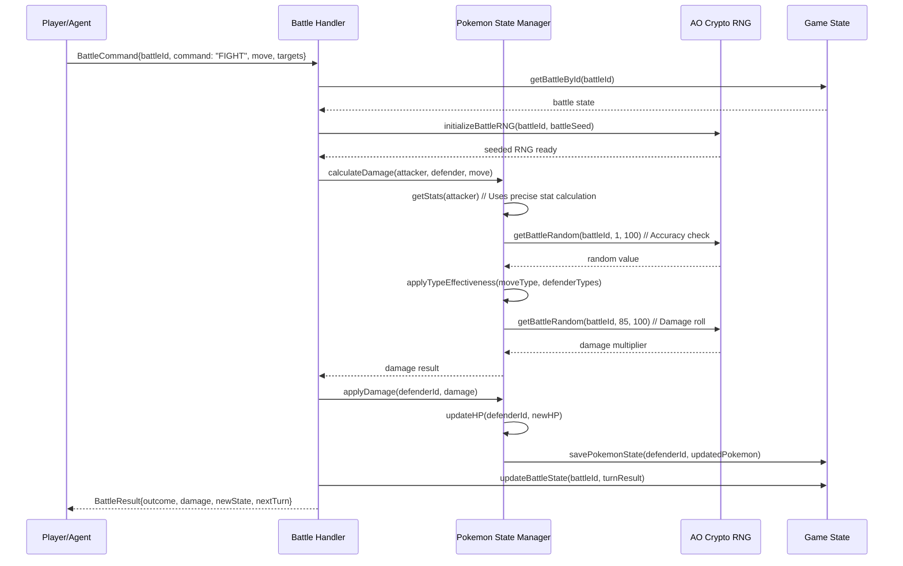
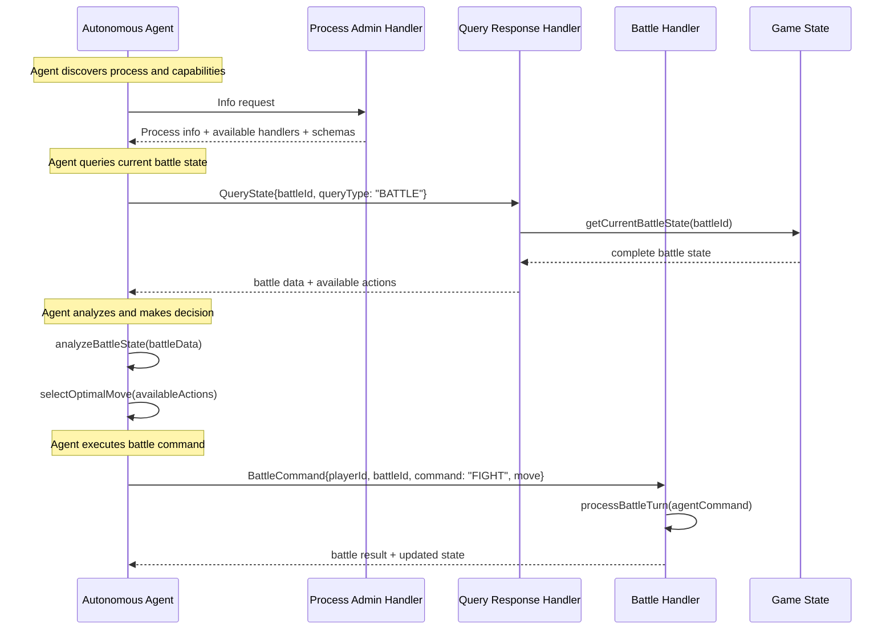

# Core Workflows

## Workflow 1: Battle Turn Resolution

```mermaid
sequenceDiagram
    participant Player as Player/Agent
    participant BH as Battle Handler
    participant PSM as Pokemon State Manager
    participant RNG as AO Crypto RNG
    participant GS as Game State
    
    Player->>BH: BattleCommand{battleId, command: "FIGHT", move, targets}
    
    BH->>GS: getBattleById(battleId)
    GS-->>BH: battle state
    
    BH->>RNG: initializeBattleRNG(battleId, battleSeed)
    RNG-->>BH: seeded RNG ready
    
    BH->>PSM: calculateDamage(attacker, defender, move)
    PSM->>PSM: getStats(attacker) // Uses precise stat calculation
    PSM->>RNG: getBattleRandom(battleId, 1, 100) // Accuracy check
    RNG-->>PSM: random value
    PSM->>PSM: applyTypeEffectiveness(moveType, defenderTypes)
    PSM->>RNG: getBattleRandom(battleId, 85, 100) // Damage roll
    RNG-->>PSM: damage multiplier
    PSM-->>BH: damage result
    
    BH->>PSM: applyDamage(defenderId, damage)
    PSM->>PSM: updateHP(defenderId, newHP)
    PSM->>GS: savePokemonState(defenderId, updatedPokemon)
    
    BH->>GS: updateBattleState(battleId, turnResult)
    BH-->>Player: BattleResult{outcome, damage, newState, nextTurn}
```

## Workflow 2: Agent Battle Decision Process (Phase 3)

```mermaid
sequenceDiagram
    participant Agent as Autonomous Agent
    participant PAH as Process Admin Handler
    participant QRH as Query Response Handler
    participant BH as Battle Handler
    participant GS as Game State
    
    Note over Agent: Agent discovers process and capabilities
    Agent->>PAH: Info request
    PAH-->>Agent: Process info + available handlers + schemas
    
    Note over Agent: Agent queries current battle state
    Agent->>QRH: QueryState{battleId, queryType: "BATTLE"}
    QRH->>GS: getCurrentBattleState(battleId)
    GS-->>QRH: complete battle state
    QRH-->>Agent: battle data + available actions
    
    Note over Agent: Agent analyzes and makes decision
    Agent->>Agent: analyzeBattleState(battleData)
    Agent->>Agent: selectOptimalMove(availableActions)
    
    Note over Agent: Agent executes battle command  
    Agent->>BH: BattleCommand{playerId, battleId, command: "FIGHT", move}
    BH->>BH: processBattleTurn(agentCommand)
    BH-->>Agent: battle result + updated state
```
