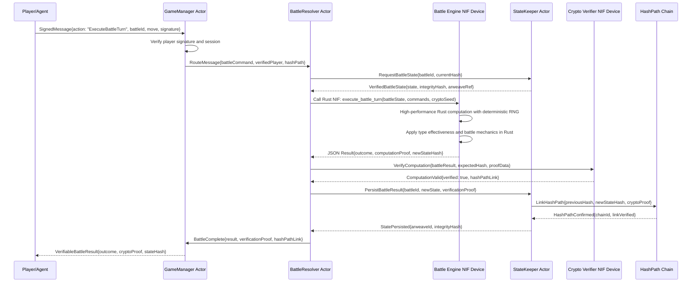
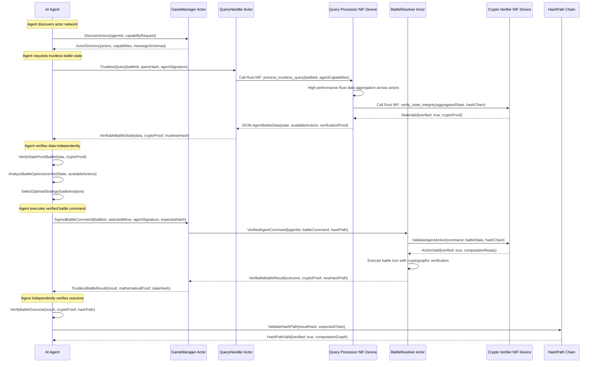
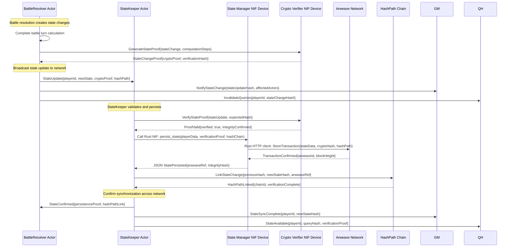
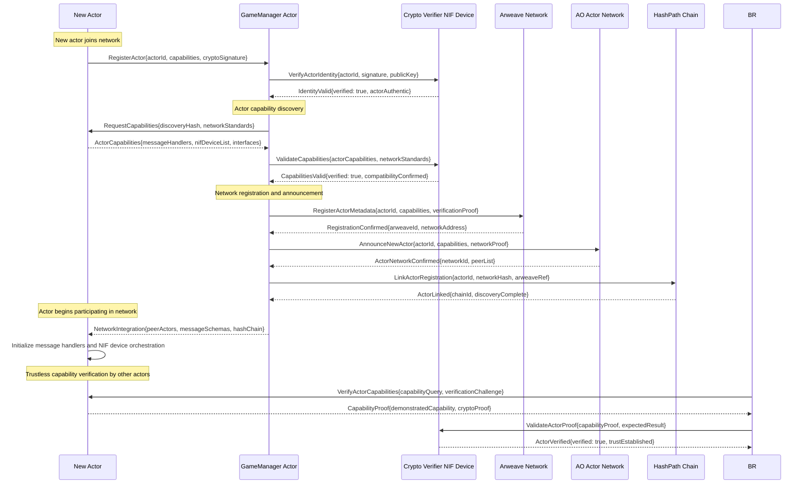

# Core Workflows

## Workflow 1: Cryptographically Verified Battle Turn Resolution

## Workflow 2: Trustless Agent Battle Decision Process

## Workflow 3: Cross-Actor State Synchronization

## Workflow 4: Permissionless Actor Discovery and Integration

## Workflow Integration Patterns

### Message-Driven Coordination
All workflows leverage AO's Actor Model where independent actors communicate exclusively through cryptographically linked messages, enabling distributed, resilient game state management.

### Cryptographic Verification
Every state change, battle outcome, and actor interaction is cryptographically verified using HashPath message chains, ensuring mathematical verifiability without requiring trust in any single actor.

### Permanent State Persistence
Game state changes are permanently stored on Arweave with cryptographic integrity verification, enabling trustless state recovery and agent verification of historical game data.

### Permissionless Extensibility
New actors can join the network permissionlessly by demonstrating compatibility with message protocols and passing cryptographic verification, enabling unlimited game ecosystem expansion.

These workflows achieve **trustless game mechanics** where all participants can independently verify game outcomes, **unlimited scalability** through distributed actor architecture, and **permissionless innovation** through standardized actor integration protocols.