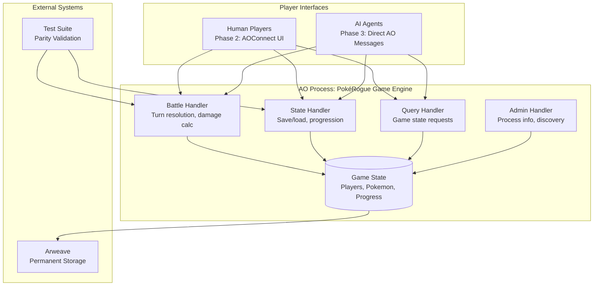

# High Level Architecture

## Technical Summary

The PokéRogue AO migration employs a **monolithic single-process architecture** running entirely on AO handlers, transforming the existing object-oriented TypeScript codebase into a functional message-driven Lua system. The architecture prioritizes **100% behavioral parity** with the current implementation while enabling autonomous agent participation through AO's message-passing protocol. Core architectural patterns include handler-based game state management, deterministic battle resolution through seeded RNG systems, and comprehensive state persistence via AO process memory, directly supporting the PRD's goal of creating the world's first fully UI-agnostic roguelike where AI agents battle as first-class citizens.

## High Level Overview

**Architectural Style:** **AO-Native Monolithic Handler System**
- Single comprehensive AO process containing all game logic as specialized Lua handlers
- Message-driven architecture replacing object-oriented event systems
- Functional programming patterns replacing class inheritance hierarchies

**Repository Structure:** **Monorepo** (from PRD Technical Assumptions)
- `/ao-processes/` - Lua handlers and AO process logic  
- `/typescript-reference/` - Current implementation for parity testing
- `/shared-schemas/` - JSON message formats and type definitions

**Service Architecture:** **Single Process with Handler Specialization**
- All game mechanics consolidated in one AO process for reference integrity
- Specialized handlers for: battles, state queries, progression, inventory management
- Future multi-process expansion supported through message protocol design

**Primary Data Flow:** **Player → AO Messages → Handler → State Update → Response**
1. Players/agents send battle commands via AO messages
2. Specialized handlers process game logic (battle resolution, state changes)
3. Process state updates atomically
4. Responses sent back with battle results and updated state

**Key Architectural Decisions:**
- **Functional Over OOP:** Lua tables with behavior functions replace TypeScript classes
- **Message-Driven:** AO messages replace Phaser.js event system
- **Atomic State:** AO process memory ensures consistent game state
- **Deterministic Logic:** Battle seed system preserved for exact behavior matching

## High Level Project Diagram

## Architectural and Design Patterns

- **AO Message-Handler Pattern:** All game interactions through `Handlers.add()` with specialized message types - _Rationale:_ Replaces OOP method calls with functional message processing, enabling agent participation

- **Functional State Management:** Game state as Lua tables with pure transformation functions - _Rationale:_ Eliminates class inheritance complexity while maintaining state consistency  

- **Deterministic Battle Resolution:** Seeded RNG system using battle-specific seeds for reproducible outcomes - _Rationale:_ Ensures exact parity with TypeScript implementation and enables battle replay/verification

- **Handler Specialization Pattern:** Single process with domain-specific handlers (Battle, State, Query) - _Rationale:_ Maintains reference integrity while organizing complex game logic

- **Atomic State Transactions:** All game state changes processed as complete units - _Rationale:_ Prevents partial state corruption and ensures consistent game progression

- **Message Protocol Abstraction:** JSON message schemas defining player/agent communication - _Rationale:_ Enables both human (Phase 2) and agent (Phase 3) interaction without architecture changes
