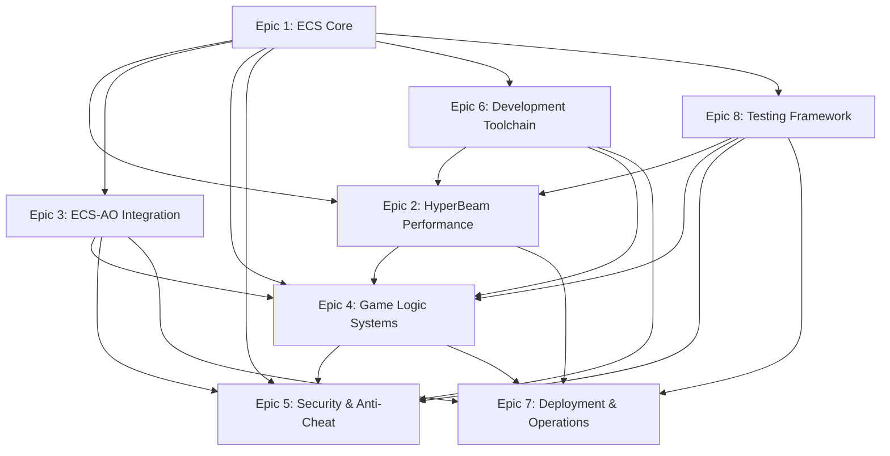

# PokéRogue ECS HyperBeam Epic Structure

## Overview
This document outlines the complete greenfield ECS HyperBeam architecture for PokéRogue, consisting of 8 focused epics that build a high-performance, cache-optimized game engine on Arweave AO.

## Epic Structure

### 🏗️ **Epic 1: ECS Core Architecture Foundation**
*Foundation for all other epics*
- Entity Manager and ID System
- Component Registration and Type System  
- Archetype Storage System
- Query System and Iterators
- Change Detection and Events

### ⚡ **Epic 2: HyperBeam Performance Engine**
*Performance optimization layer*
- SIMD Component Processing Framework
- Data-Oriented Transform System
- HyperBeam Battle Calculation Engine
- Memory Pool and Cache Management
- Parallel System Execution Framework
- Performance Profiling and Analytics

### 🔗 **Epic 3: ECS-AO Integration Bridge**
*Blockchain integration layer*
- ECS-AO Message Translation Layer
- Component Serialization System
- Entity State Synchronization
- AO Process ECS Runtime
- Cross-Process ECS Communication
- Blockchain Event Integration

### 🎮 **Epic 4: Game Logic Component Systems**
*Core gameplay implementation*
- Pokemon Entity Component Architecture
- Battle System ECS Implementation
- Move Effect Component Framework
- Item and Equipment System
- Player Progression and Experience Systems
- World and Environment Systems

### 🛡️ **Epic 5: ECS Security & Anti-Cheat Framework**
*Security and integrity systems*
- Component Validation Framework
- Entity Integrity Monitoring
- System Behavior Analysis
- Cryptographic Component Security
- Network Security and Communication Protection
- Audit and Compliance System

### 🖥️ **Epic 6: ECS Development Toolchain**
*Developer experience and tooling*
- Entity Inspector and Debugger
- System Performance Profiler
- Component Authoring and Schema Tools
- ECS Query Builder and Optimizer
- System Orchestration and Flow Designer
- Asset Pipeline and Build Integration

### 🚀 **Epic 7: ECS Deployment & Operations**
*Production operations*
- ECS Process Bundling and Packaging
- Entity State Persistence and Recovery
- System Health Monitoring and Metrics
- Zero-Downtime Deployment System
- Multi-Environment Management
- Operational Automation and Maintenance

### 📊 **Epic 8: ECS Testing & Quality Framework**
*Testing and quality assurance*
- ECS Unit Testing Framework
- Integration Testing for Multi-System Scenarios
- Performance and Load Testing Suite
- Component and System Validation Testing
- Test Data Management and Fixtures
- Continuous Testing and Quality Gates

## Epic Dependencies

## Implementation Timeline

### Phase 1: Foundation (Weeks 1-4)
- **Epic 1**: ECS Core Architecture Foundation
- **Epic 6**: Basic Development Toolchain
- **Epic 8**: Core Testing Framework

### Phase 2: Performance & Integration (Weeks 5-8)
- **Epic 2**: HyperBeam Performance Engine
- **Epic 3**: ECS-AO Integration Bridge

### Phase 3: Game Systems (Weeks 9-12)
- **Epic 4**: Game Logic Component Systems
- **Epic 5**: Security & Anti-Cheat Framework

### Phase 4: Production Ready (Weeks 13-16)
- **Epic 7**: Deployment & Operations
- **Epic 6**: Advanced Development Toolchain (completion)
- **Epic 8**: Comprehensive Testing (completion)

## Performance Targets

| Epic | Key Performance Target |
|------|------------------------|
| Epic 1 | >90% cache hit rates for typical queries |
| Epic 2 | 10x performance improvement through SIMD |
| Epic 3 | <10ms message translation overhead |
| Epic 4 | <5ms battle turns, <1μs Pokemon stat calculations |
| Epic 5 | <1% security validation overhead |
| Epic 6 | Zero runtime impact development tools |
| Epic 7 | <5 minute zero-downtime deployments |
| Epic 8 | <10 minute complete test suite execution |

## Success Metrics

### Technical Metrics
- **Performance**: 10x improvement over traditional OOP approaches
- **Bundle Size**: <500KB per AO process with full functionality
- **Cache Efficiency**: >90% L1 cache hit rates for hot paths
- **Security**: >99% cheat detection accuracy with <1% false positives

### Quality Metrics
- **Test Coverage**: >95% code coverage with property validation
- **Performance Regression**: Zero performance regression on key metrics
- **Documentation**: Complete API documentation and developer guides
- **Developer Experience**: <30 second build times, <100ms test feedback

## Architecture Principles

### Data-Oriented Design
- Structure-of-Arrays (SoA) memory layouts
- Cache-friendly data access patterns
- SIMD-optimized component processing

### Entity-Component-System
- Composition over inheritance
- Data and behavior separation
- System-based processing logic

### Performance First
- Cache optimization as primary concern
- SIMD vectorization where applicable
- Memory allocation minimization

### AO Integration
- Seamless blockchain persistence
- Efficient serialization protocols
- Cross-process ECS communication

## Benefits Summary

### Performance Benefits
- **10x Performance**: Through SIMD optimization and cache efficiency
- **Scalable Architecture**: Linear scaling with CPU cores and entity counts
- **Memory Efficiency**: Minimal allocation overhead with optimized layouts

### Development Benefits
- **Type Safety**: Compile-time component validation and access patterns
- **Extensibility**: Data-driven gameplay through component composition
- **Tooling**: Comprehensive debugging and profiling capabilities

### Operational Benefits
- **Reliability**: Robust deployment and monitoring systems
- **Security**: Comprehensive anti-cheat and validation frameworks
- **Maintainability**: Clear separation of concerns with ECS patterns

---

**This greenfield ECS HyperBeam architecture represents a complete reimagining of PokéRogue optimized for performance, scalability, and maintainability on the Arweave AO platform.**